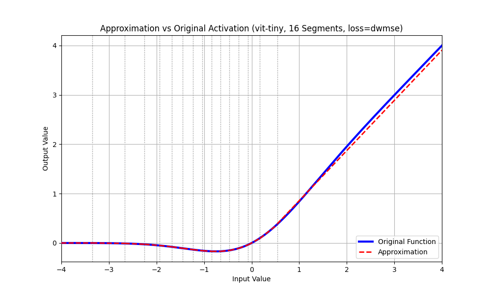

# DAPA Project (Anonymous Submission)

> Anonymous code repository for a double-blind conference review.

The project name **DAPA** is used only as an internal label for this repo and does not necessarily match the final paper title.

---

## Environment Setup
Setup Environment by:
```
pip install -r requirements.txt
```

## Demo Evaluation
As running full test will take many times and put high requirment to your PC RAM and GPU VRAM.
For quick the demo purpose, you can run the
```make```
which test ViT/Small/Base Model, with DAPA(16) segments.
This cmd is running ViT Varients Model with DAPA-16(16 segments, No of image for distribution:256)
You can view the result from 'src_cls'
* src_cls/dst_log : You can view the test log file, include network performance;
* src_cls/dst_plot : You can view the figure which include the original function and its DAPA approximation;



* src_cls/dst_pwl : You can view the json file, which is config file for DAPA include segment points and coffe for ax+b;

```
dst_pwl demo:
    "intervals": [
        [
            "-inf",
            "-9.930583"
        ],
        [
            "-9.930583",
            "-6.573429"
        ],
    ]
    "params": [
        {
            "p1": 0.0,
            "p0": 0.0
        },
        {
            "p1": -1.611651355024917e-14,
            "p0": -1.4029910592064354e-13
        },
    ]
```

## Project Description

```
├── figure              : Figure for Readme file;
├── LICENSE             : LICENSE information;
├── Makefile            : Support Quick Demo Run;
├── README.md           
├── requirements.txt    : PiP Lib list to setup env;
└── src_cls             : DAPA for Image Classifcaiton Transformer;
    ├── config.py       : To Fully Test ImageNet-1K set "SAMPLE_NUM" to 50000
    ├── m0_udanf.py     : The implementation of DAPA based activation;
    ├── m1_poly_act.py  : The implementation of Polynomial based activation;
    ├── Makefile        : Flow control
    ├── t0_make_pwl.py  : To generate thed DAPA config file for various pre-trained model;
    ├── t1_vit_run.py   : Runing ViT Model;
    └── t2_make_poly.py : To generate thed Poly config file for various pre-trained model;
```